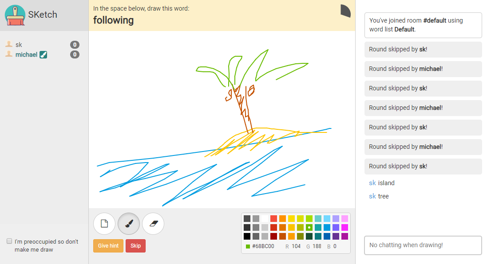
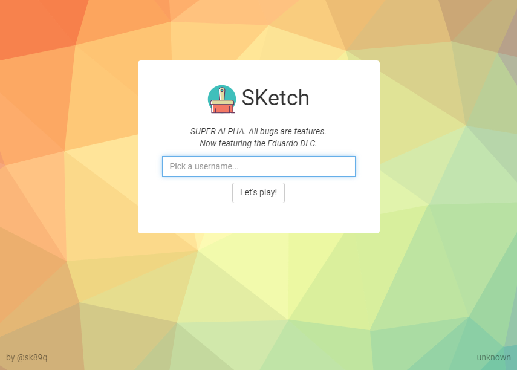

# pySketch 🎨✍

Drawing charades-inspired game server. The objective is to guess what the artist is drawing.
Winners get points. Losers discover pity.

#### ⚠ BIG Warnings ⚠

This project is a little old, a little *sketch*, but was updated to work in 2020
amidst certain global events.

I am pretty sure there is only one room.

## Requirements

**BIG REQUIREMENT:** You own a Linux server and know how to configure one.

Technical knowledge required: Pasting commands

## Setup and Usage

These steps are for a Debian-based system (i.e. Ubuntu).

1. Download the project. Put it somewhere and `cd` to it.
1. [Install Docker](https://docs.docker.com/install/).
1. `sudo apt-get install -y docker-compose`
1. `docker-compose build && docker-compose up -d` (remove the -d if you want to see the log when it starts up)

⚠ Installation takes a long time. Get some coffee — and maybe some raspberry filled donuts.

Now, go to `http://YOUR_IP:8280/`

### Commands

* `@@setwordlst Whatever` - Set the word list to `Whatever` (word lists are in words/)